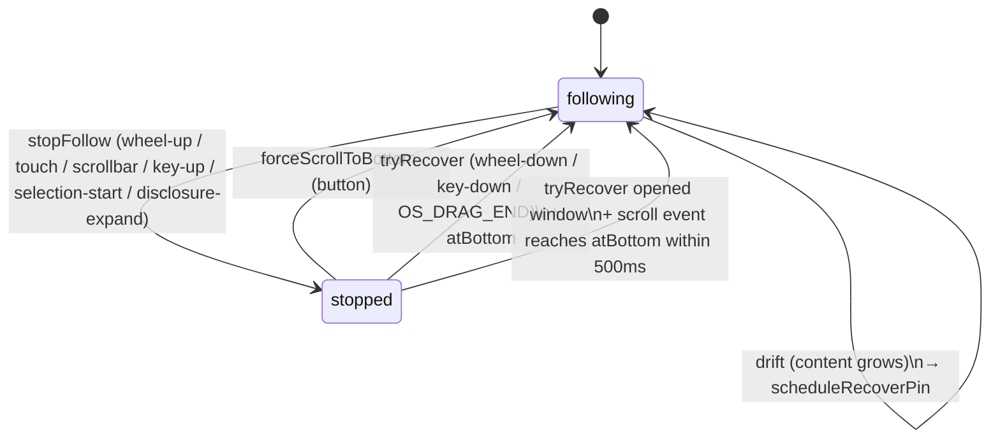
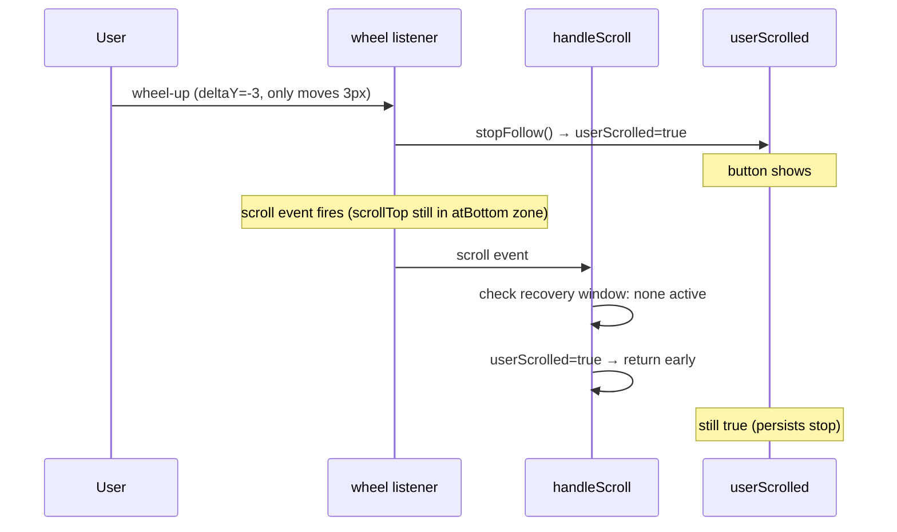
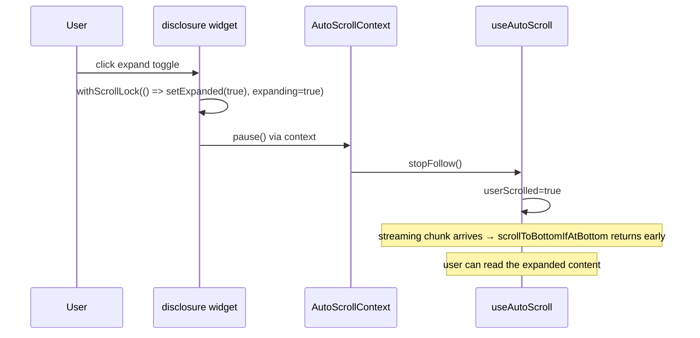
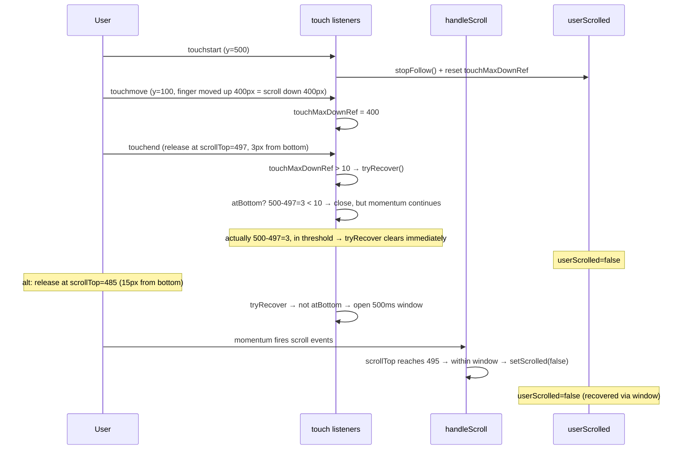

# Chat scroll-follow design

This document explains the design of the chat scroll-following system.
If you're touching `useAutoScroll.ts`, `ChatArea.tsx`, or any input
handler that affects scroll behavior, read this first.

## Core principle

`userScrolled` is the single source of truth for "is the user actively
following the chat stream to the bottom". It is set ONLY by direct user
input events, NEVER by `scroll` events alone.

This is a deliberate inversion of the previous design, which tried to
reverse-engineer user intent from `scroll` events using a `markAuto`
timestamp token (programmatic writes were marked, then `scroll` events
checked whether a recent mark existed). The old design had several
unfixable bugs because some `scroll` events have no JS-visible input
precursor (layout shifts, viewport resize clamps, find-in-page, history
restoration) — see `CONSTRAINTS` memory #60.

## State machine



Two states, three transition types. No intermediate state.

## Input → intent mapping

| Input | Condition | Action |
|---|---|---|
| `wheel` (deltaY < 0) | target in chat root, not editable, no nested boundary | `stopFollow()` |
| `wheel` (deltaY > 0) | target in chat root, not editable, no nested boundary | mark recovery gesture; `handleScroll` completes it at bottom |
| `wheel` (any direction) | target inside marked nested scrollable, movement stays inside it | no-op for chat follow |
| `wheel` (deltaY < 0) | marked nested scrollable is already at top | `stopFollow()` |
| `wheel` (deltaY > 0) | marked nested scrollable is already at bottom | mark recovery gesture; outer scroll may complete it |
| `touchstart` | target in chat root, not editable | `stopFollow()` + reset `touchMaxDownRef` |
| `touchmove` | during a touch gesture | update `touchMaxDownRef` (max downward displacement) |
| `touchend` | `touchMaxDownRef > 10` (real downward drag) | `tryRecover()` |
| `touchend` | no downward drag (tap / up-fling) | no-op |
| `pointerdown` on scrollbar | target === scroll root, clientX in scrollbar region | `stopFollow()` |
| `pointerup` | (any) | no-op (mouse-up is not a "scroll down" gesture) |
| `keydown` PageUp/Home/ArrowUp | focus in chat root, not editable | `stopFollow()` |
| `keydown` PageDown/End/ArrowDown | focus in chat root, not editable | `tryRecover()` |
| `selectionchange` empty → non-empty | selection anchor in chat root | `stopFollow()` |
| `selectionchange` non-empty → empty | (any) | no-op |
| `OS_DRAG_START` (overlayScrollbar) | custom event from custom scrollbar thumb | `stopFollow()` |
| `OS_DRAG_END` (overlayScrollbar) | custom event on pointerup from thumb | `tryRecover()` |
| disclosure expand (`withScrollLock(_, true)`) | | `stopFollow()` |
| disclosure collapse (`withScrollLock(_, false)`) | | no-op |
| `scrollToMessageId` / `scrollToMessageIndex` | | calls `pause()` (= `stopFollow`) |

## Recovery rules

`userScrolled` is cleared by:

1. `forceScrollToBottom()` — imperative "scroll to bottom" button
2. `tryRecover()` or `markRecoverGesture()` — invoked by an explicit "down" input:
   - If `scrollTop` is within `bottomThreshold` → clear immediately
   - Otherwise → open a 500ms recovery window; subsequent `scroll` events
     that find `scrollTop` back at bottom will complete the recovery.
     This handles iOS momentum and "drag-to-bottom-then-release-with-1px-error".
3. The recovery window closes on: success, timeout (500ms elapsed), or any
   subsequent `stopFollow` / `setScrolled` call.

`scroll` events themselves **do not** clear `userScrolled` outside of an
active recovery window — this is what makes "tiny wheel-up persists stop"
work correctly.

## Why this works

The fundamental insight is that user input events have well-defined
intent at the moment they fire:

- `wheel` with `deltaY < 0` → user wants to go up
- `touchstart` → user is touching (likely about to scroll)
- `pointerdown` on scrollbar → user is dragging the scrollbar
- `keydown` PageUp → user wants to go up
- `selectionchange` empty → non-empty → user is selecting text

Each input declares its intent. We don't need to infer it from a
downstream `scroll` event that conflates user and programmatic scrolls.

## Why nested scrollables need special handling

When the wheel target is inside a nested scrollable (code block, diff
viewer, long thinking block), the user is reading content *inside* that
block, not navigating the chat. Wheel-down inside a code block doesn't
mean "I want to follow the chat" — it means "scroll this code down".

Detection: `findScrollableAncestor(target, root)` finds the nearest
ancestor marked with `data-scrollable`. `shouldMarkBoundaryGesture()`
then checks whether the wheel delta would move that nested element past
its top or bottom boundary. This mirrors OpenCode's boundary model:
scrolling inside a block is private to that block; only an overflow
attempt becomes an outer chat gesture.

New nested vertical scroll components should mark their scroll viewport
with `data-scrollable`. Shared `ScrollArea`, `CodeBlock`, `DiffViewer`,
and Markdown code-preview viewports already do this.

## Bottom threshold

Single threshold: `bottomThreshold = 10` (px). Used for:

- `tryRecover` deciding whether to clear `userScrolled`
- `handleScroll` deciding whether to schedule `recoverPin`

The 60/150px thresholds in `ChatArea.tsx` are for `isAtBottom` (passed
to `useMobileCollapse` for the input-box pill behavior) and are
unrelated to follow state.

## AutoScrollContext

Disclosure widgets (Tool, Reasoning, Task, Todo, Subtask, System,
MessageError, ProcessCollapse) live deep in the message tree, far from
ChatArea which owns the `useAutoScroll` instance. They use
`useDisclosureScrollLock`, which internally `useContext(AutoScrollContext)`
to get a `pause` callback wired to `useAutoScroll.pause`.

The context value is stable (memoized on `auto.pause`, which is itself
a stable `useCallback`), so consuming components don't re-render when
the value changes (it doesn't change).

## ToBottom button visibility

Driven by `userScrolled` (via `onFollowingChange` callback from
`ChatArea` to `ChatPane`), NOT by positional `isAtBottom`. This means
a tiny wheel-up that doesn't move scroll position will still show the
button (because `userScrolled = true`).

This is correct: the button is the recovery mechanism for "user has
stopped following". Whether they're positionally near the bottom is
irrelevant to whether they want to recover.

## Testing

29 integration tests in `useAutoScroll.test.tsx` cover the state machine
end-to-end (wheel, touch, keyboard, OS_DRAG, recovery window, nested
scrollable, rapid events). Tests use a `Harness` component that calls
`setScrollRef` from `useLayoutEffect` (matching React's production commit
order: ref callbacks fire before `useEffect`).

Manual verification still recommended for browser-only behaviors
(real momentum scrolling, capture phase edge cases, getComputedStyle
under actual CSS):

1. Streaming stays pinned to bottom
2. Tiny wheel-up persists stop (button shows)
3. Wheel-down recovers when reaching bottom (immediate or via window)
4. Touch scroll: drag up stops, genuine drag down to bottom recovers (tap doesn't)
5. Scrollbar drag (custom overlayScrollbar): stops on dragstart, recovers on dragend if at bottom
6. Keyboard: PageUp stops, PageDown recovers at bottom
7. Text selection stops following; clearing selection doesn't recover
8. Disclosure expand stops; collapse doesn't change state
9. Wheel inside code block only affects chat when it overflows the block boundary
10. Click "scroll to bottom" button always recovers
11. iOS momentum: drag down, release with 1-2px error → still recovers within 500ms window

## Key scenario sequence diagrams

### Tiny wheel-up persists stop



### Disclosure expand during streaming



### iOS touch drag-down + momentum recovery



### Wheel inside nested code block (only boundary overflow escapes)

```mermaid
sequenceDiagram
    participant U as User
    participant W as wheel listener
    participant F as findScrollableAncestor
    participant S as userScrolled

    U->>W: wheel-down (deltaY=+50) inside code block
    W->>F: findScrollableAncestor(target, root)
    F-->>W: returns code-block div (data-scrollable)
    W->>F: shouldMarkBoundaryGesture(delta, nested)
    F-->>W: false (nested block still has room)
    Note over S: chat follow state is unchanged
    U->>W: wheel-down again at code-block bottom
    W->>F: shouldMarkBoundaryGesture(delta, nested)
    F-->>W: true (wheel would overflow nested bottom)
    W->>S: mark recovery gesture; outer scroll can recover at bottom
```
